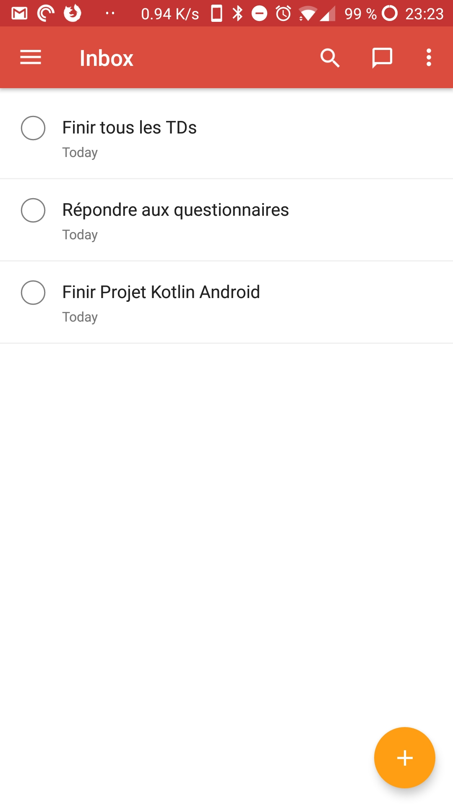
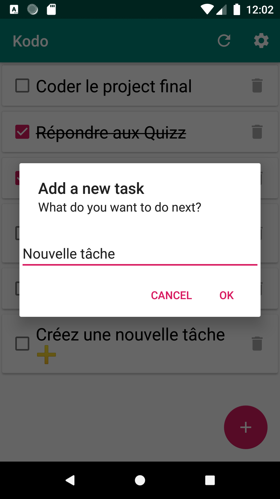
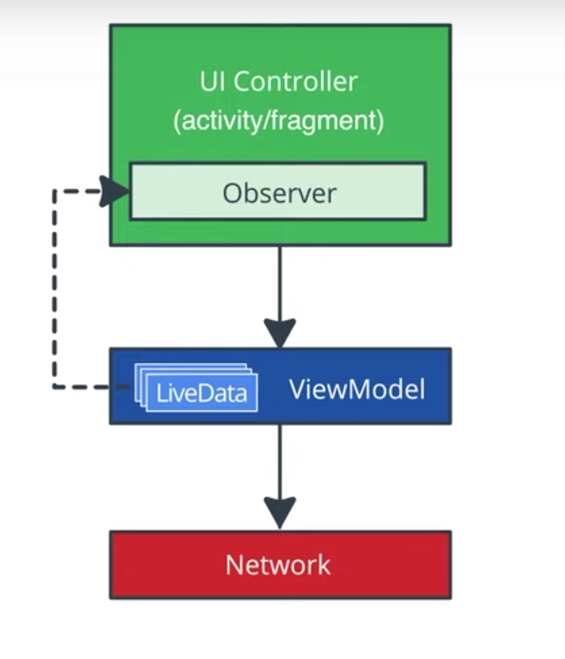

# Kodo

Ce projet est un exemple d'implémentation du sujet ci dessous, donné à des débutants sur Android et Kotlin.

Je ne prétend pas qu'il est parfait bien sûr mais c'est un point de départ.

Je n'ai pas eu le temps de tout faire pour l'instant (notamment la partie offline avec Room).


# Projet: TODO App

Écrire une application de gestionnaire de tâches basée sur [Todoist](https://todoist.com)

## Features principales

- Afficher la liste des taches (juste le texte) dans une RecyclerView
- Ajouter une tâche 
- Supprimer une tâche
- Afficher et modifier le statut d'une tâche:
	- Cocher et barrer le texte
	- Décocher et "dé-barrer" le texte

## UI

Todoist | Example            |  
:---:|:-------------------------:
 |  

## Architecture Components
Essayez de suivre [l'architecture recommandée par Android](https://developer.android.com/jetpack/docs/guide) et d'utiliser les [Architecture Components](https://developer.android.com/topic/libraries/architecture)

Archi de base | Archi idéale          
:---:|:-------------------------:
 |
ViewModel, LiveData, DataBinding, Observer | + Room, Navigation, Repository Pattern, Coroutines


## Features supplémentaires
Suggestions:

- Afficher une vue pour le détail d'une tâche 
- Ajouter des options dans le menu de l'AppBar
	- Refresh
	- Supprimer tout
- Ajouter une page [PreferenceScreen](https://developer.android.com/guide/topics/ui/settings.html) pour modifier des paramètres comme: 
	- Inverser l'ordre de la liste 
	- Texte par défaut pour nouvelles tâches
	- Titre de l'écran principal
	- Activer rappels
- Ajouter la lib [Anko](https://github.com/Kotlin/anko) et l'utiliser pour simplifier l'utilisation des Dialog, Snackbar et autres 
- Implémenter  le ["Pull to refresh"](https://developer.android.com/training/swipe/add-swipe-interface.html)
- Utiliser des [Coroutines](https://developer.android.com/topic/libraries/architecture/coroutines)
- Mode offline ([guide](https://proandroiddev.com/add-offline-support-using-room-ecee194c503e))
- Changer la date avec un [Picker](https://developer.android.com/guide/topics/ui/controls/pickers.html)
- Ajouter des tests unitaires
- Ajouter des tests UI

Vous pouvez me proposer des modifications de sujet (utiliser une autre API par ex.) ou d'autres features si vous avez des idées (si je valide, rappelez le dans votre `ReadMe`)

# Aide

## Conseils
* Comme pour tout projet, essayer d'avancer petit à petit plutôt que vouloir tout faire d'un coup
* Vous pouvez commencer à faire une version basique en codant tout dans l'activity puis refactoriser pour améliorer l'architecture
* Vous pouvez commencer par une "Basic Activity" d'Android Studio pour avoir un "FAB" 
* Utilisez ce bouton (avec une icone "+") pour ajouter une tache
* Utilisez un [AlertDialog](https://developer.android.com/reference/android/app/AlertDialog) avec un `EditText` pour récupérer un input du user (cf. plus bas)


## Utilisation de l'API

Utilisez [Retrofit](https://square.github.io/retrofit/) et [Moshi](https://github.com/square/moshi) comme précédemment pour récupérer et afficher des taches que vous aurez créées dans la version web de Todoist.

Se référer à la [doc de l'API](https://developer.todoist.com/rest/v8/#tasks) (Cliquer sur "REST API" en haut puis "Tasks" à gauche)

Vous verrez que les tasks peuvent contenir beaucoup d'infos mais de base on utilisera seulement `"id"`, `"completed"` et `"content"`

Pour aller plus loin, on pourra éventuellement aussi utiliser `"due"` pour la date ou `"project_id"` pour effacer tout (par défaut les taches appatiennent à un projet "Inbox")

Pour récupérer la liste des taches on requête l'adresse
`"https://beta.todoist.com/API/v8/tasks"`

Ce qui se décompose ainsi:

- BASE_URL: `"https://beta.todoist.com/API/v8/"`
- QUERY: `"tasks"`

## Authentification

On pourrait implémenter un login, ou utiliser OAuth mais on va faire plus simple: créez vous un compte et récupérez le TOKEN ici: [https://todoist.com/prefs/integrations](https://todoist.com/prefs/integrations) (au bas de la page, appelé "Clé API" ex: b2d1bce0c9437ed84b2bc4364413b26e8bb9f4e3)

Ce token doit être ajouté dans le "header" (ici avec curl):

```bash
curl -X GET \
	https://beta.todoist.com/API/v8/tasks \
	-H "Authorization: Bearer $token”
```

Pour faire ça sur Android avec il faut ajouter un Interceptor au client OKHTTP que l'on passe à Retrofit 

Alors, oui ça fait beaucoup de libs pour une seule phrase mais en vrai ça veut juste dire que chaque requête notre faite avec notre instance Retrofit va ajouter le header automatiquement:

```kotlin
val TOKEN = "b2d1bce0c9437ed84b2bc4364413b26e8bb9f4e3"

val okHttpClient = 
	    OkHttpClient.Builder()
	                .addInterceptor { chain ->
	                    val newRequest = chain.request().newBuilder()
	                        .addHeader("Authorization", "Bearer $TOKEN")
	                        .build()
	                    chain.proceed(newRequest)
	                }.build()
                        
var retrofit = Retrofit.Builder()
        .client(okHttpClient)
        .baseUrl("https://beta.todoist.com/API/v8/")
        .addConverterFactory(MoshiConverterFactory.create())
        .build()
```

## Exemple: Service Retrofit

```kotlin

interface TodoService {

    // ...

    @POST("tasks")
    @Headers("Content-Type: application/json")
    suspend fun createTask(@Body task: Task): Task?
    
    // ...
    
 }
 
```

## Exemple: Repository

```kotlin
class TodoRepository {
    private val todoService = ApiFactory().todoService

    // ...

    fun getTasksAsync(): Deferred<Response<List<Task>>> {
        return todoService.getTasks()?.sortedByDescending { it.id }
    }
    
    // ou bien :
    
    suspend fun getTasks(): Response<List<Task>> {
        return todoService.getTasks()?.sortedByDescending { it.id }
    }
    
    // ...
}
```

## Exemples: Coroutines
Pour utiliser les résultats de `Deferred` ou lancer des méthodes `suspend`, il faut le faire dans une Coroutine, ce qui nécessite un CoroutineScope:

```kotlin
coroutineScope.launch {
	tasks = getTasksAsync().await()
	// ou bien :
	tasks = getTasks()
}
```

on peut utiliser `GlobalScope` mais il vaut mieux utiliser un scope adapté: 

On peut le créer à la main, par exemple comme ceci: 

`val coroutineScope = CoroutineScope(Job() + Dispatchers.Main)` ou bien `val coroutineScope = MainScope()`

soit l'implémenter avec une `delegate`: `MyActivity : AppCompatActivity, CoroutineScope by MainScope()` 

Dans ces 2 cas, il faut gérer le scope et utiliser `cancel()` dans `onDestroy()` par exemple

Sinon, le plus simple est d'ajouter les libs `lifecycle` correspondantes, pour avoir accès à `lifecycleScope` dans les `Activity` et `Fragment`, et `viewModelScope` dans les `ViewModel`


## Exemple: ApiFactory

```kotlin

class ApiFactory {
    private val okHttpClient by lazy {
        val httpLoggingInterceptor = HttpLoggingInterceptor()
        httpLoggingInterceptor.level = HttpLoggingInterceptor.Level.BODY
        OkHttpClient.Builder()
            .addNetworkInterceptor(httpLoggingInterceptor)
            .addInterceptor { chain ->
                val newRequest = chain.request().newBuilder()
                    .addHeader("Authorization", "Bearer $TOKEN")
                    .build()
                chain.proceed(newRequest)
            }
            .build()
    }

    private val moshi = Moshi.Builder()
        .add(KotlinJsonAdapterFactory())
        .build()

    private val retrofit = Retrofit.Builder()
        .client(okHttpClient)
        .baseUrl(BASE_URL)
        .addConverterFactory(MoshiConverterFactory.create(moshi))
        .build()

    val todoService: TodoService by lazy { retrofit.create(TodoService::class.java) }

    companion object {
        const val TOKEN = "b2d1bce0c9437ed84b2bc4364412b28e8db9f4e3"
        const val BASE_URL = "https://beta.todoist.com/API/v8/"
    }
}
```


### Remarque importante
On ne peut malheureusement pas récupérer les tâches cochées avec l'API Todoist...du coup cocher puis refresh revient à supprimer mais décocher avant de refresh sert au moins à annuler la suppression.

### En fait !
J'ai finalement trouvé un moyen détourné de récupérer les tâches cochées:

```kotlin
@FormUrlEncoded
@POST("https://todoist.com/API/v8.1/items/get_completed")
suspend fun getCompletedTasks(
    @Field("offset") offset: Int = 0,
    @Field("project_id") projectId: Long = 1111111111 // id de votre projet par défaut "inbox"
): List<Task>?
```


## Barrer du texte

J'ai écrit une extension sur `TextView` pour vous aider:

```kotlin
private var TextView.strikeThrough
		get() = paintFlags and Paint.STRIKE_THRU_TEXT_FLAG > 0
		set(value) {
		    paintFlags = if (value)
		        paintFlags or Paint.STRIKE_THRU_TEXT_FLAG
		    else
		        paintFlags and Paint.STRIKE_THRU_TEXT_FLAG.inv()
    	}
```

Exemple d'utilisation: 

```kotlin
textView.strikeThrough = true
```

## Créer un AlertDialog


Avec le framework Android seul, dans le context d'une activity ou Fragment:

```kotlin
private fun showAddItemDialog(onFinish: (String?) -> Unit) {
    val editText = EditText(this)
    val dialog = AlertDialog.Builder(this)
        .setTitle("Add a new task")
        .setMessage("What do you want to do next?")
        .setView(editText)
        .setPositiveButton("Add") { _, _ -> onFinish(editText.text.toString()) }
        .setNegativeButton("Cancel") { _, _-> onFinish(null) }
        .create()
    dialog.show()
}
```

Ou alors avec Anko:

```kotlin
private fun showAddItemDialog(onFinish: (String?) -> Unit) {
val editText = EditText(this)
alert("What do you want to do next?", "Add a new task") {
	    customView = editText
	    okButton { onFinish(editText.text.toString()) }
	    cancelButton { onFinish(null) }
	    onCancelled { onFinish(null) }
	}.show()
}
```

# Barême approximatif

- Compile / 5
- Fonctionnement de base / 5
- Archi et propreté du code / 5
- 1 point supplémentaire pour chaque feature, élément d'archi, ou test unitaire supplémentaire.

Bien sûr il faudra coder en **Kotlin** et éviter d'avoir du code trop similaire aux autres... 🤨
